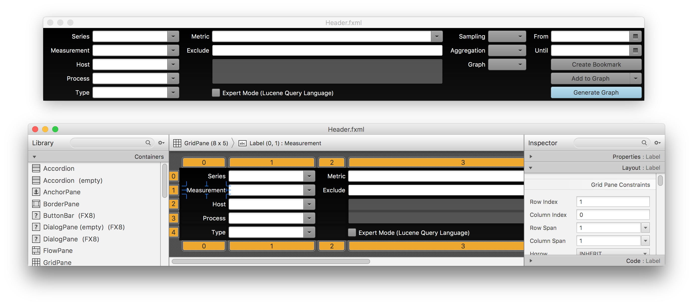
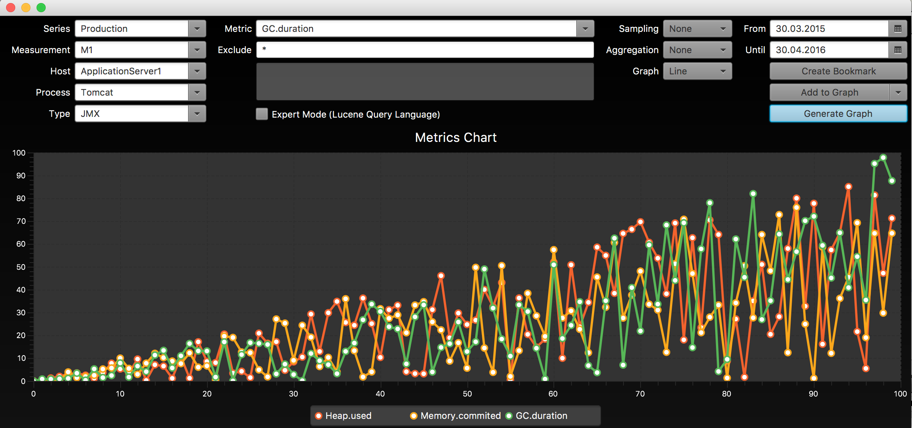

# Vorlesung-GUI-2016
Vorlesung Grafische Benutzeroberflächen 2016

### Empfohlene Voraussetzungen

Solide Kenntnisse der objektorientierten Programmierung in Java

## Lernziele und Inhalt

### Modulziele/Angestrebte Lernergebnisse

Die Studierenden erlernen die ergonomische Gestaltung, den Entwurf und die Programmierung grafischer Oberflächen. Sie können eine Oberfläche so gestalten, dass ein Benutzer damit effektiv und effizient arbeiten kann. Sie können Desktop-Technologien wie JavaFX sachgerecht anwenden. Die Studierenden verstehen die zugrunde liegenden Architekturkonzepte und können diese Technologien einordnen und bewerten. Weiter erhalten sie einen tiefen Einblick in die Grundlagen der Software-Architektur von Systemen 
mit graphischen Oberflächen.

## Inhaltsübersicht

Die Veranstaltung hat drei Schwerpunkte: Entwurf und Architektur von Anwendungen mit grafischer Benutzeroberfläche. Überblick über aktuelle Technologien, Werkzeuge und Methoden für den Bau von Anwendungen mit umfangreichen Anforderungen an die Bedienbarkeit und Interaktion. Praktisches Anwenden der erlernten Techniken im Rahmen von Übungen.
Der größte Teil der Veranstaltung verwendet JavaFX. Der Schwerpunkt liegt nicht im Erlernen des eher zufälligen JavaFX-APIs, sondern in der Vermittlung der grundsätzlichen Ideen und Entwurfsmuster. Besonderes Gewicht liegt auf Standardfragen der täglichen 
Praxis (z.B. Bestätigen/Verwerfen, Data-Binding, Internationalisierung, Nebenläufigkeit und Anwendungsarchitektur). Im Rahmen von Studienarbeiten werden weitere moderne Technologie wie beispielweise .NET/WPF, Android oder HTML5 betrachtet.

Begleitend zur Vorlesung finden Übungen zur Vertiefung der erlernten Konzepte statt. 

### Inhalt

#### 0. <a href="docbase/00-Orga.pdf">Organisatorisches (Sommersemester 2016)</a>
- Ablauf von Vorlesung und Übung
- Themen und Termine
- Hinweise zur verwendeten Software
- Literatur

#### 1. <a href="docbase/01-Grundlagen.pdf">Grundlagen grafischer Oberflächen</a>

- Historischer Überblick
- Typen grafischer Oberflächen (Terminal, Mobil, Web, Rich-Client)
- Standardprobleme beim Entwurf und der Programmierung
- Ergonomie und Angemessenheit
- Programmierte und deklarierte Oberflächen

<a href="docbase/U-01-Arbeitsfaehigkeit.pdf">Übungsblatt 1</a>

#### 2. <a href="docbase/02-Komponenten-und-Layout.pdf">Gestaltungsregeln und Layout - Überblick JavaFX</a>

- Gestaltungsregeln
- Grafischer Entwurf - Methoden und Werkzeuge (Styleguides, Mockups)
- Dynamisches Layout – Konzepte und Grundlagen
- Einführung in JavaFX
- Komponenten und Container - Exkurs Composite-Muster 
- Layout-Management 

<a href="docbase/U-02-Gridlayout.pdf">Übungsblatt 2</a>

<a href="codebase/u2-gridlayout/">Musterlösung 2</a>

#### 3. <a href="docbase/03-Events.pdf">Eventgesteuerte Programmierung</a>
- Kontrollfluss in grafischen Oberflächen
- Begriffe der Eventverarbeitung
- Eventverarbeitung in hierarchischen Oberflächen (Bubbling und Capturing)
- Technische Umsetzung
- Ereignisse als Objekte
- Zustellung von Ereignissen
- Behandlung von Ereignissen (Handler, Event-Hierarchie)  
- Datenhaltung, Benachrichtigung und Binding

<a href="docbase/U-03-Events.pdf">Übungsblatt 3</a>

<a href="codebase/u3-events/">Musterlösung 3</a>

#### 4. <a href="docbase/04-MVx.pdf">Probleme beim Datenhaushaltg</a>
- Das Observer-Muster
- Model-View-Controller – das klassische Modell
- Model-View-Presenter
- Technische Umsetzung
- JavaFX Properties
- JavaFX Binding

<a href="docbase/U-04-MVx.pdf">Übungsblatt 4</a>

<a href="codebase/u4-mvp/">Musterlösung 4</a>

#### 5. <a href="docbase/05-MVx-GUI-Komponenten.pdf">GUI Komponenten und Wiederverwendung</a>
- Grundprinzipien und Architektur
- Eigenschaften von Komponenten
- MV* im Großen
- Presentation-Model vs. Business-Model
- Technische Umsetzung
- Bau von GUI Komponenten mit JavaFX
- Wiederverwendung und Schachtelung

<a href="docbase/U-05-GUI-Komponenten.pdf">Übungsblatt 5</a>

<a href="codebase/u5-mvp/">Musterlösung 5</a>

#### 6. Parallelverarbeitung in grafischen Oberflächen
- Motivation – Warum ist parallele Verarbeitung notwendig?
- Umgang mit lang laufenden Aktionen (asynchrone Verarbeitung)
- Technische Umsetzung
- Die Worker Schnittstelle in JavaFX
- Die Klassen Task und Service

#### 7. Zentrale Anwendungssteuerung – Der Eventbus
- Motivation
- Das Publish-Subscriber Muster
- Technische Umsetzung
- Ein minimaler Eventbus
- Subscription als Annotation

#### 8. Anwendungsarchitektur
- 2-Tier und 3-Tier Architekturen
- Thin-, FAT- und Smart/Rich-Clients
- Schichten-, Säulen und Komponentenarchitekturen
- Technische Umsetzung
- Trennung von Businesslogik und Oberflächenlogik
- Umsetzung einer Kundensuche mit JavaFX

#### 9. Grafische Oberflächen im Browser
- Typen von Weboberflächen (Web 1.0, 2.0, 3.0)
- Vor- und Nachteile der heute gängigen Architekturen
- Technische Umsetzung
- CRUD Anwendung mit HTML5 und AngularJS

#### 10. Test von grafischen Oberflächen
- Manuelles Testen und Test-Driven-Development
- Behavior-Driven-Test-Development
- Das Page-Objekt-Muster
- Testautomation bei JavaFX Oberflächen

### Literatur

Besonders empfohlen

1. Tidwell, J.: Designing Interfaces, O’Reilly, (2005)
2. http://docs.oracle.com/javase/8/javase-clienttechnologies.htm: Online Dokumentation und Tutorials zu JavaFX (2015)
3. Gamma, E., et al.: Design Patterns. Addison-Wesley (1995)

Zusätzlich empfohlen

4. Siedersleben, J.: Moderne Software-Architektur, dpunkt (2004)
5. Fowler, M.: Patterns of Enterprise Application Architecture. Addison-Wesley (2002)
6. Fowler, M.: http://martinfowler.com/eaaDev/uiArchs.html (2006)
